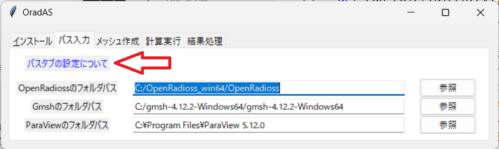
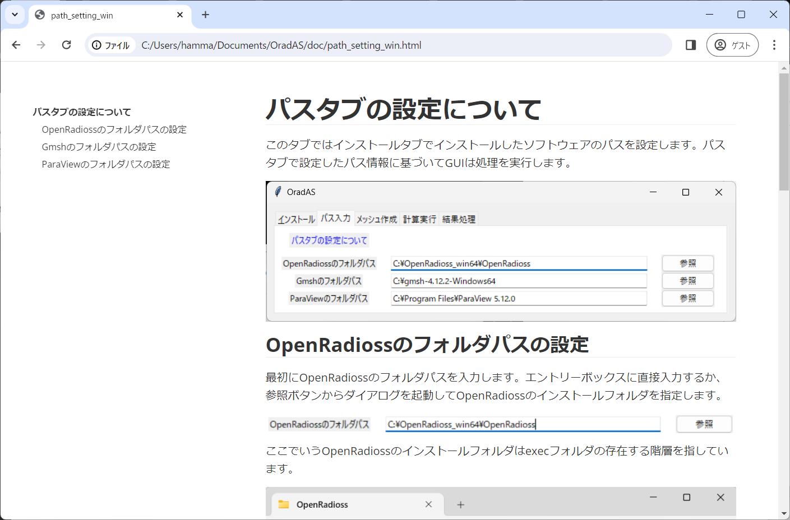
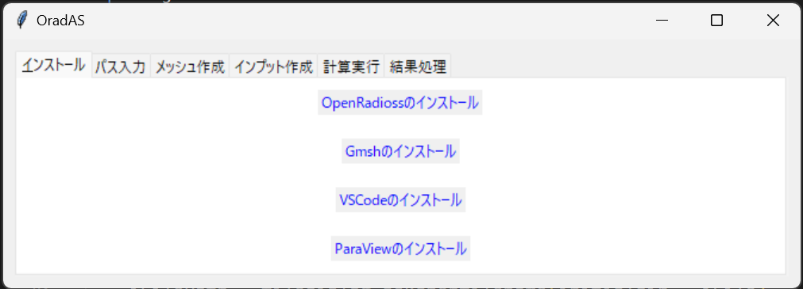
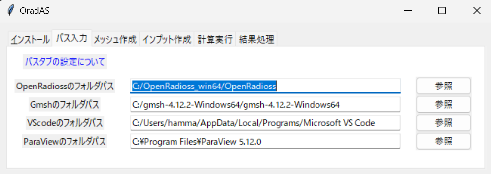

## 日本語 Readme

## OradASについて

OradASは"OpenRadioss Assistant System"の略語です。ORadASではOpenRadiossの利用に当たり必要となるツールのインストールから使用方法までを手助けすることを目的に作成されています。

通常、OpenRadiossはコマンドで実行しないといけないですが、ORadASのGUIでは数回のクリックだけで実行できます。

OradASはPythonの標準ライブラリだけで作成されています。サードパーティのライブラリを大量にインストールする必要はありません。

OradASは英語の苦手な人でも使えるように日本語で構成されています。英語対応は将来的な機能追加で実施します。

OradAS開発中の機能についてはissueをご覧ください。

## バージョン履歴

2024/03/30 : Version 1.0 release.基本的な機能を実装。
2024/03/30 : Version 1.1 release.結果処理タブの誤字修正。
2024/03/30 : Version 1.2 release.並列計算CPU数の指定機能追加。

## 起動要件

Python (>=3.10)

## 使用方法

次のコマンドで起動できます。

`python main.py`

使い方はGUI内にドキュメントとして埋め込んでいます。

## 初期設定

まずはインストールタブのドキュメントから各種ソフト宇lら、アドインのインストールをお願いします。

次にパス入力タブからソフトウェアのフォルダパスを設定すれば使用準備完了です。

## ライセンス

OradASはMIT licenseを採用しています。

# English Readme

## About OradAS

OradAS stands for "OpenRadioss Assistant System" and was created to help you install and use the tools you need to use OpenRadioss.

Normally, OpenRadioss has to be run with commands, but with the ORadAS GUI it can be done with just a few clicks.

OradAS was created using only the standard Python library. There is no need to install a lot of third-party libraries.

OradAS is written in Japanese so that even people who are not good at English can use it. English support will be added in the future.

For more information about features under development in OradAS, please see the issue.

## Version up log

2024/03/30 : Version 1.0 release. Has a basic function.
2024/03/30 : Version 1.1 release. Correction of typographical errors in the results processing tab.
2024/03/30 : Version 1.2 release. Additional functionality for specifying the number of parallel calculation CPUs.

## requirement

Python (>=3.10)

## usage rules

It can be started with the following command

`python main.py`

The usage is embedded as documentation in the GUI.

## initialisation

First, please install the various software and add-ins from the documents in the Installation tab. 

Next, set the software folder path from the Path input tab and you are ready to use the software. 

## License

OradAS is MIT licensed.
