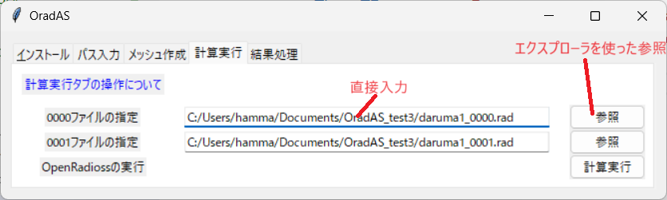
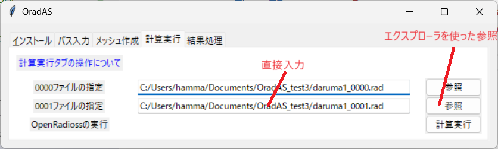
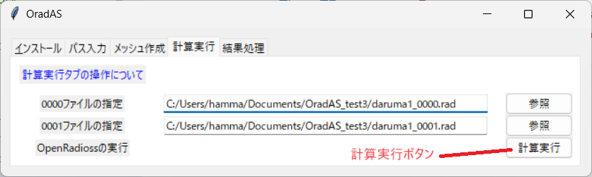
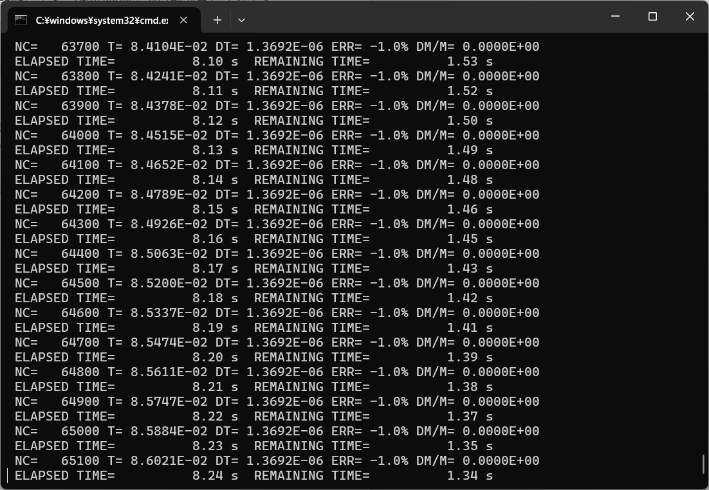
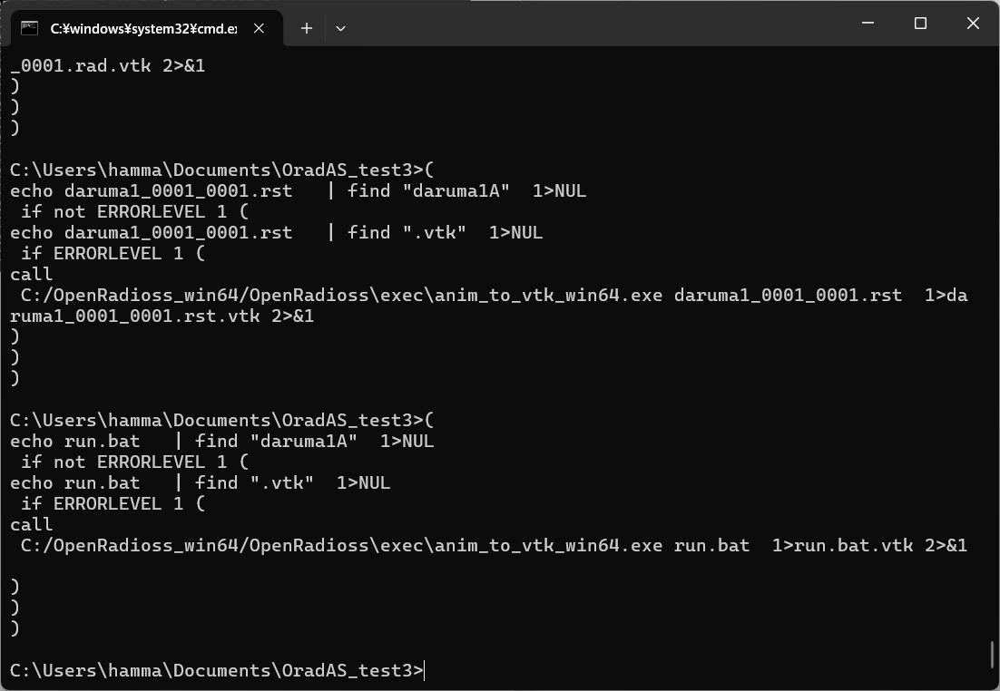

# 計算実行タブの操作方法について

計算実行タブでは次の処理を実行します。

* 入力された0000ファイルを使用してstarterを実行する。
* 入力された0001ファイルを使用してengineを実行する。
* engine実行後のAnnファイルに対してvtkに変換する処理を実行する。

## 前提条件

0000ファイルと0001ファイルは同じフォルダに置いた状態から処理を始めてください。

## 0000ファイルの指定

0000ファイルの指定欄でエントリーボックスに直接入力するか、参照ボタンを使った計算を実行する0000ファイルを指定してください。

## 0001ファイルの指定

0001ファイルの指定欄でエントリーボックスに直接入力するか、参照ボタンを使った計算を実行する0001ファイルを指定してください。

## 計算の実行

計算実行ボタンをクリックすると計算が開始します。

vtkの変換まで自動で実行されます。

終了後のコマンドプロンプトは実行ログを確認できるように表示したままにしています。ログの確認が終わったら右上の×ボタンをクリックして消してください。

これで計算実行タブの操作は終了です。