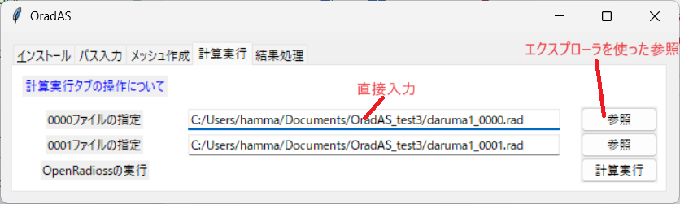
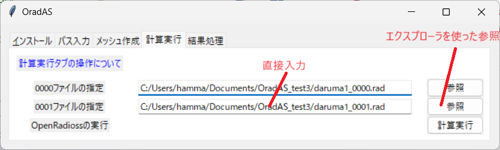

# How to Operate the Calculation Execution Tab

The calculation execution tab performs the following processes:

* Executes the starter using the specified 0000 file.
* Executes the engine using the specified 0001 file.
* Converts the Ann file generated by the engine into a vtk file.

## Prerequisites

Ensure that the 0000 file and the 0001 file are placed in the same folder before starting the process.

## Specifying the 0000 File

In the 0000 file specification field, either directly input the file path into the entry box or use the browse button to specify the 0000 file to be used for the calculation.

## Specifying the 0001 File

In the 0001 file specification field, either directly input the file path into the entry box or use the browse button to specify the 0001 file to be used for the calculation.

## Executing the Calculation

Click the calculation execution button to start the calculation.

The process will automatically proceed to the vtk conversion.

After completion, the command prompt will remain open to allow you to check the execution log. Once you have finished reviewing the log, click the × button in the top-right corner to close it.

This concludes the operation of the calculation execution tab.