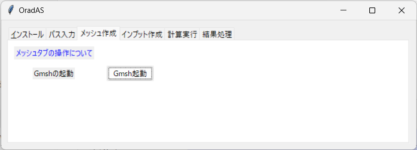
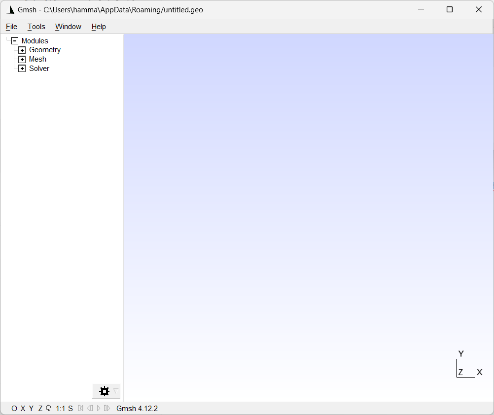

# How to Operate the Mesh Tab

The mesh tab provides the following functionality:

* Launching Gmsh

## Launching Gmsh

Click the Gmsh launch button to start Gmsh. The Gmsh that launches will be based on the folder path entered in the path tab.

Load CAD files or other files and start creating the mesh.

