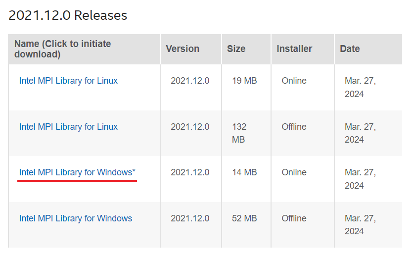
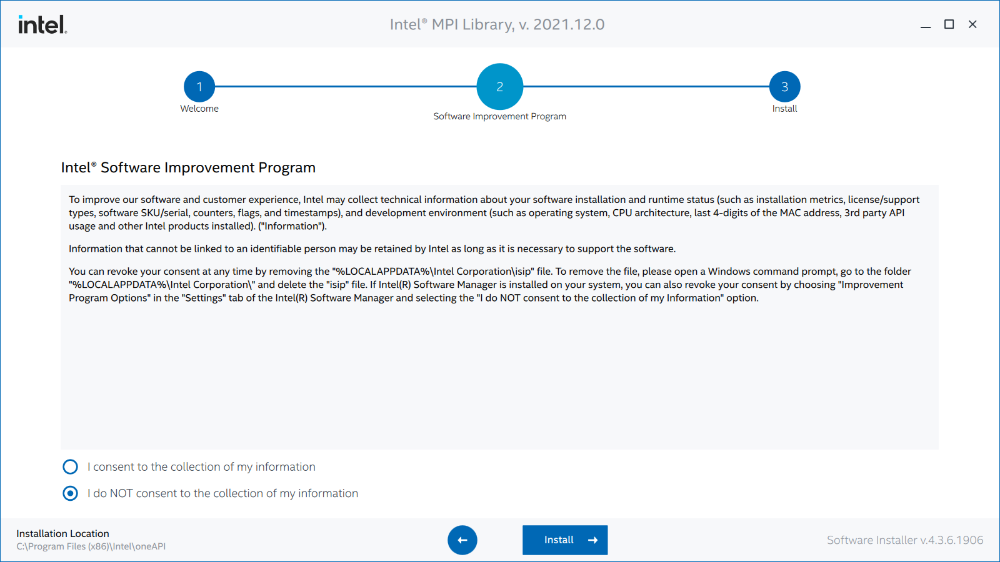
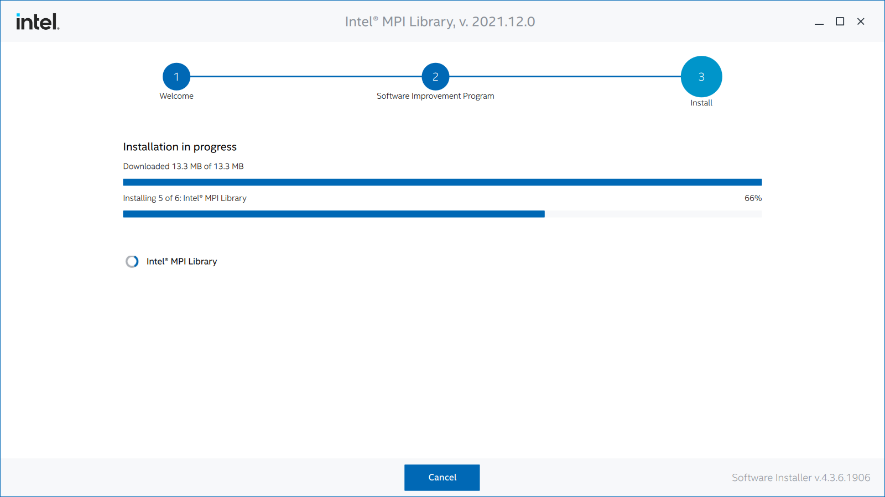

# OpenRadiossのインストール

OpenRadiossのインストール手順について示します。ここではWindows版のインストール方法を示します。

## インストーラのダウンロード

OpenRadiossのパッケージを[GithubのReleaseページ](https://github.com/OpenRadioss/OpenRadioss/releases )からダウンロードします。

最新版をダウンロードするようにしてください。

ダウンロードしたファイルを解凍してください。

## Intel MPI Libraryのインストール

並列計算のためにIntel MPI Libraryのインストールが必要になります。[Intel MPI Libraryのページ](https://www.intel.com/content/www/us/en/developer/articles/tool/oneapi-standalone-components.html#mpi)にアクセスします。Windowsのインストーラをクリックしダウンロードします。このドキュメントではOnline版をダウンロードしています。

ダウンロードされたインストーラを起動します。

起動したらシステムのチェックが始まるので、Continueをクリックします。

チェックが終わるとインストール設定画面が表示されるので、I accept the term of the license agreementにチェックを入れて、Continueをクリックします。

インテルのソフトウェア改良プログラムに参加するかどうか聞いてくる画面が表示されますので、好きな方を選んでInstallをクリックします。

しばらく待ちます。

インストールが終わったら小さなウィンドウが表示されるので、Finishをクリックして終了します。

これでインストールは終了です。
