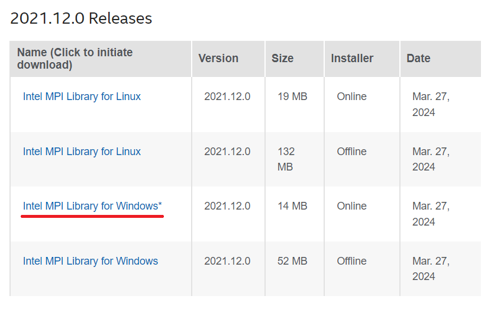
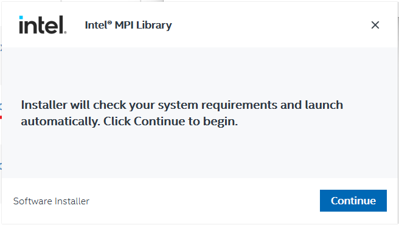
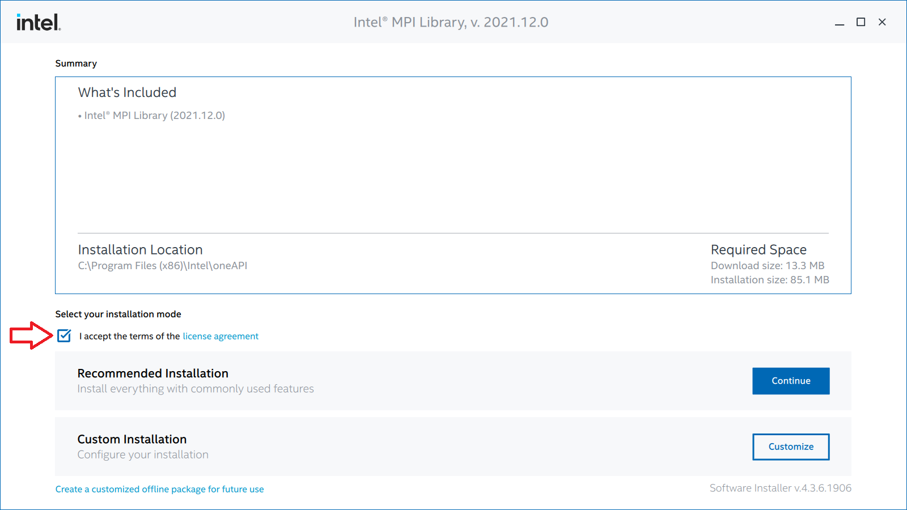
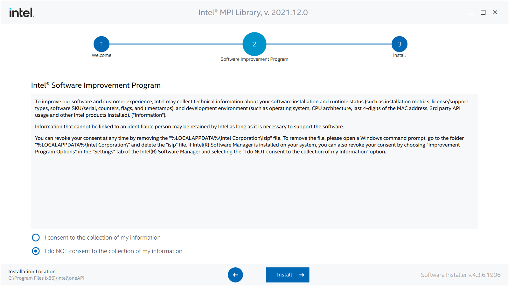
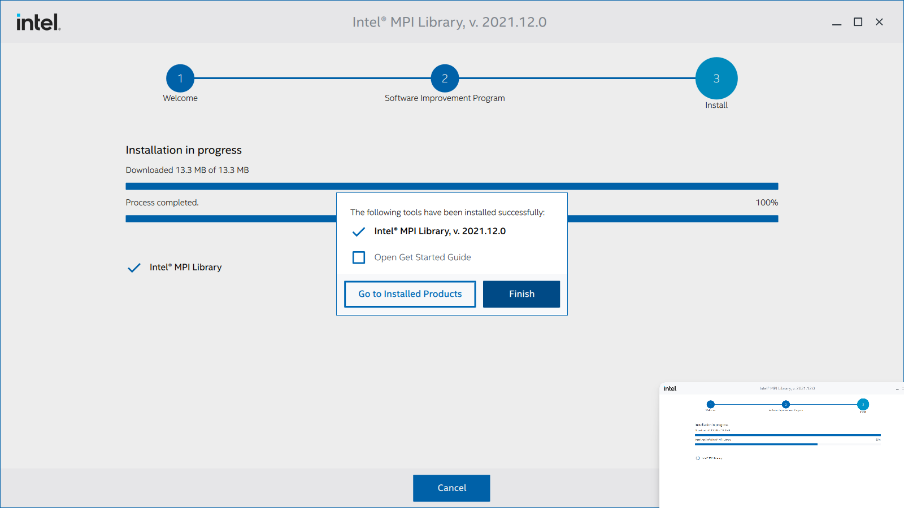

# Installing OpenRadioss

This document describes the installation procedure for OpenRadioss. Here, the installation method for the Windows version is explained.

## Downloading the Installer

Download the OpenRadioss package from the [GitHub Release Page](https://github.com/OpenRadioss/OpenRadioss/releases).

Make sure to download the latest version.

Extract the downloaded file.

## Installing the Intel MPI Library

To perform parallel computations, you need to install the Intel MPI Library. Access the [Intel MPI Library Page](https://www.intel.com/content/www/us/en/developer/articles/tool/oneapi-standalone-components.html#mpi). Click the Windows installer to download it. In this document, the Online version is downloaded.

Launch the downloaded installer.

Once launched, the system check will begin. Click **Continue**.

After the check is complete, the installation settings screen will appear. Check **I accept the terms of the license agreement** and click **Continue**.

A screen will appear asking if you want to participate in Intel's software improvement program. Choose your preference and click **Install**.

Wait for a while.

When the installation is complete, a small window will appear. Click **Finish** to exit.

This completes the installation.
