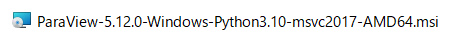
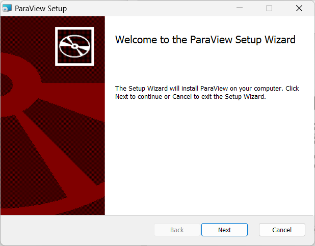
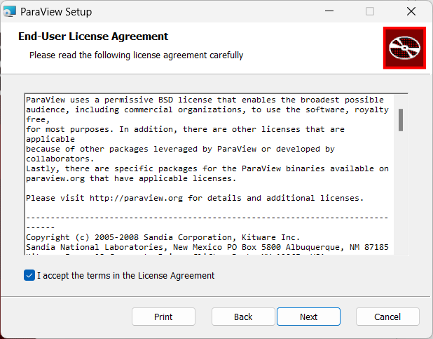
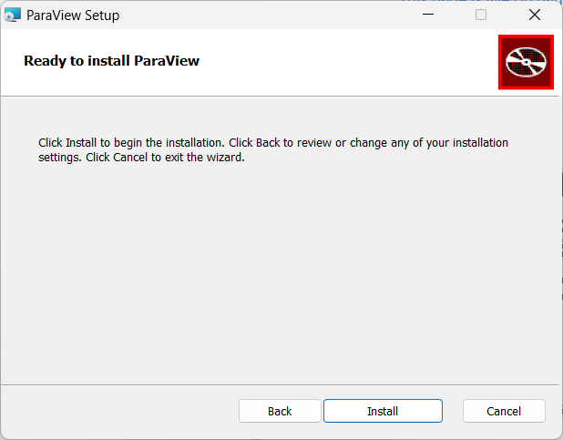
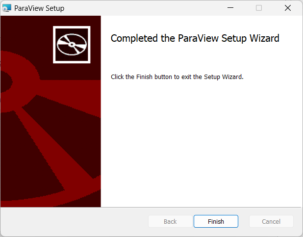

# ParaViewのインストール

## インストーラのダウンロード

[ParaViewのダウンロード](https://www.paraview.org/download/)ページからダウンロードします。本ドキュメントではVersionはv5.12で説明を進めます。Version欄がv5.12となっていることを確認し、その下に表示される「MPI」と含まれていないmsiファイルをクリックしてダウンロードします。

ダウンロードしたmsiファイルをクリックして、インストーラを起動します。

インストーラが起動したらNextをクリックします。

エンドユーザーライセンスの同意画面が表示されるので、チェックボックスをクリックして、Nextをクリックします。

次にインストールフォルダの場所を入力することを求められるので、デフォルトのままNextヲクリックします。

インストールの最終確認画面が表示されるのでInstallをクリックしてインストールします。

しばらく待ちます。

Completed～と書かれたウィンドウが表示されたインストールは終了です。Finishをクリックして終了してください。

これでParaViewのインストールは終了です。
