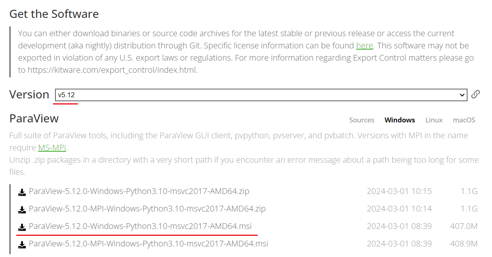
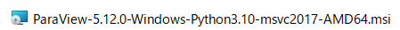
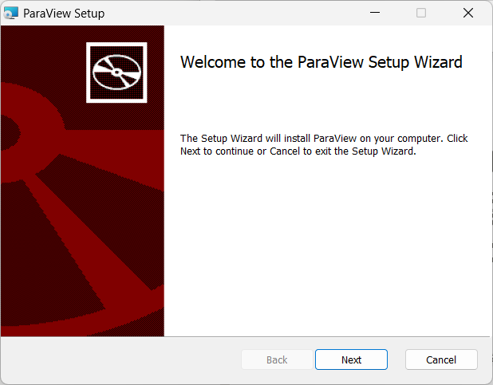
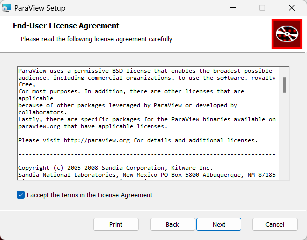
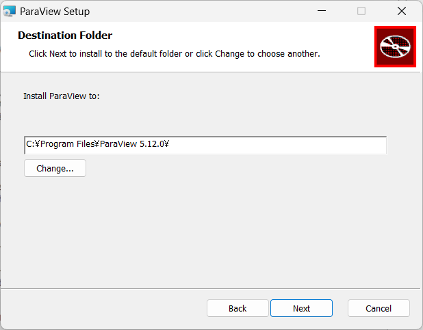
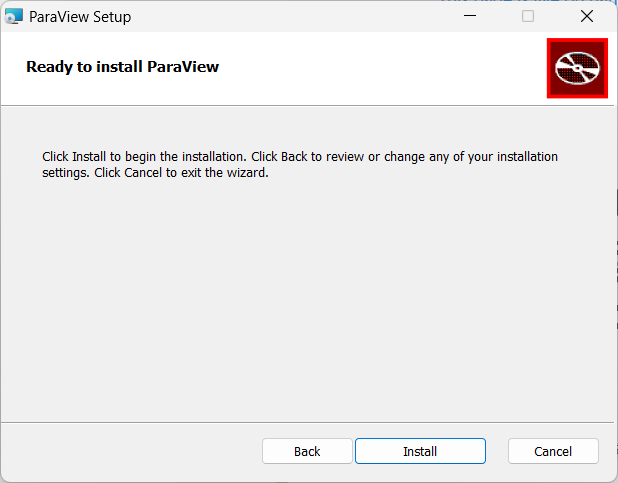
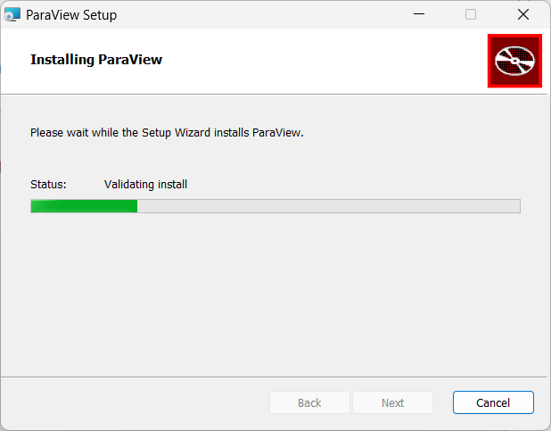
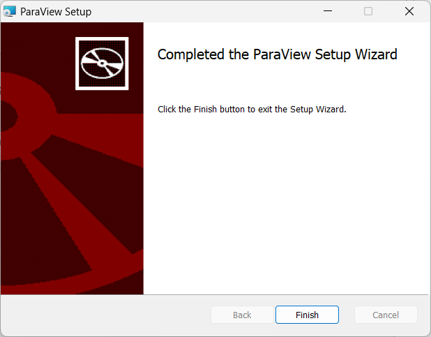

# Installing ParaView

## Downloading the Installer

Download it from the [ParaView Download](https://www.paraview.org/download/) page. This document explains the process using version v5.12. Ensure that the version field shows v5.12, and click the msi file without "MPI" in its name to download it.

Click the downloaded msi file to launch the installer.

Once the installer starts, click **Next**.

The End User License Agreement screen will appear. Check the box to accept the terms, then click **Next**.

Next, you will be prompted to specify the installation folder. Leave it as the default and click **Next**.

The final confirmation screen for installation will appear. Click **Install** to proceed with the installation.

Wait for the installation to complete.

When a window displaying "Completed~" appears, the installation is finished. Click **Finish** to exit.

This completes the installation of ParaView.
