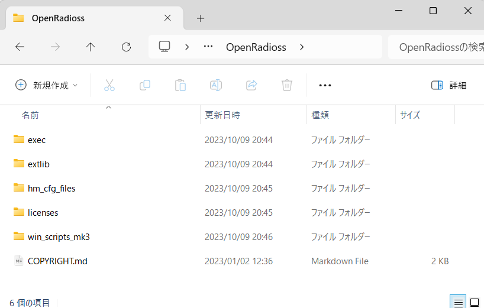
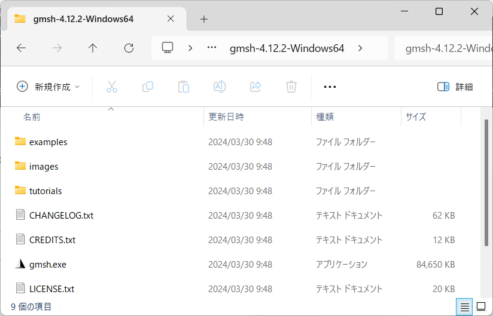
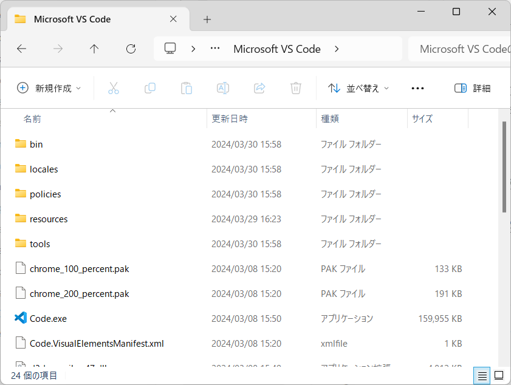
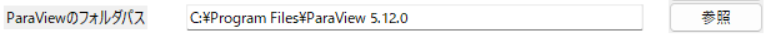
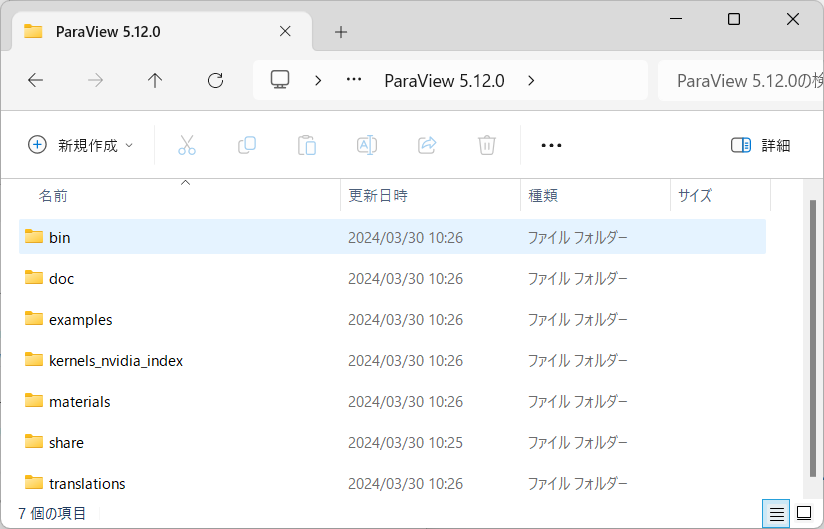

# パスタブの設定について

このタブではインストールタブでインストールしたソフトウェアのパスを設定します。パスタブで設定したパス情報に基づいてGUIは処理を実行します。

## OpenRadiossのフォルダパスの設定

OpenRadiossのフォルダパスを入力します。エントリーボックスに直接入力するか、参照ボタンからダイアログを起動してOpenRadiossのインストールフォルダを指定します。

ここでいうOpenRadiossのインストールフォルダはexecフォルダの存在する階層を指しています。

## Gmshのフォルダパスの設定

Gmshのフォルダパスを入力します。エントリーボックスに直接入力するか、参照ボタンからダイアログを起動してGmshのインストールフォルダを指定します。

ここでいうGmshのインストールフォルダはgmsh.exeの存在する階層を指しています。

## VSCodeのフォルダパスの設定

VSCodeのファイルパスを入力します。エントリーボックスに直接入力するか、参照ボタンからダイアログを起動してVSCodeのインストールフォルダを指定します。

ここでいうVSCodeのインストールフォルダはCode.exeの存在する階層を指しています。

## ParaViewのフォルダパスの設定

ParaViewのフォルダパスを入力します。エントリーボックスに直接入力するか、参照ボタンからダイアログを起動してParaViewのインストールフォルダを指定します。

ここでいうParaViewのインストールフォルダはbinフォルダの存在する階層を指しています。

