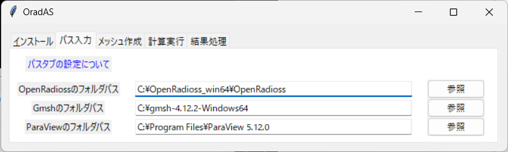
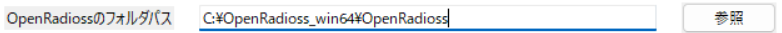
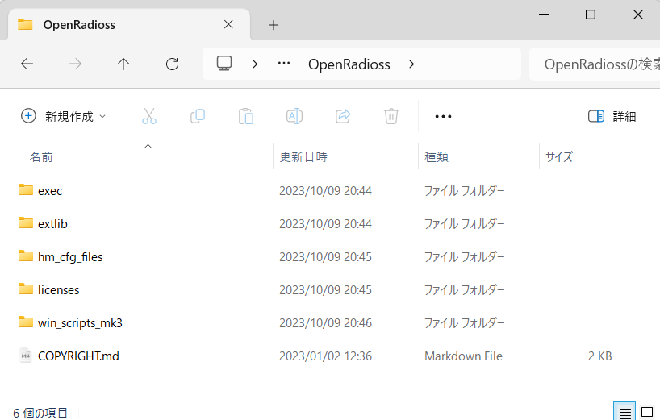
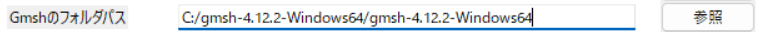
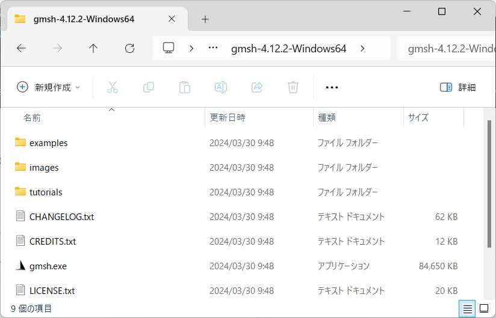
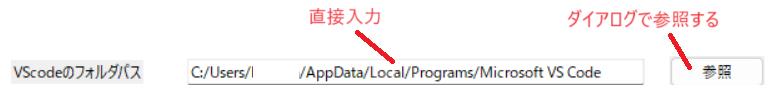
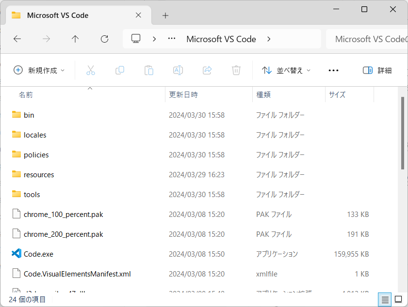
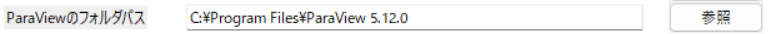
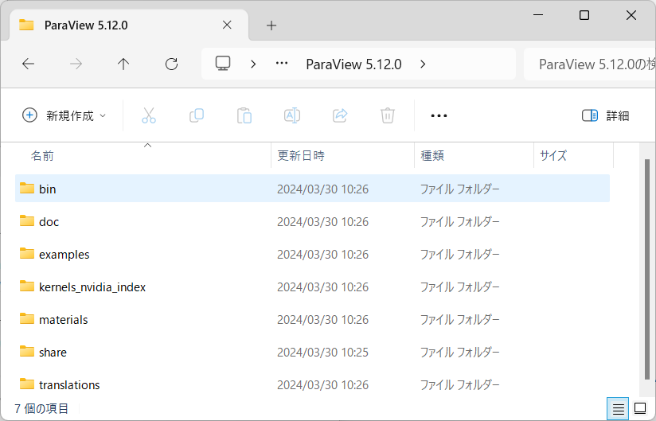

# Path Tab Settings

This tab is used to set the paths for the software installed via the installation tab. The GUI executes processes based on the path information set in the path tab.

## Setting the Folder Path for OpenRadioss

Enter the folder path for OpenRadioss. You can either input it directly into the entry box or use the browse button to open a dialog and specify the installation folder for OpenRadioss.

The OpenRadioss installation folder here refers to the directory where the `exec` folder exists.

## Setting the Folder Path for Gmsh

Enter the folder path for Gmsh. You can either input it directly into the entry box or use the browse button to open a dialog and specify the installation folder for Gmsh.

The Gmsh installation folder here refers to the directory where `gmsh.exe` exists.

## Setting the Folder Path for VSCode

Enter the file path for VSCode. You can either input it directly into the entry box or use the browse button to open a dialog and specify the installation folder for VSCode.

The VSCode installation folder here refers to the directory where `Code.exe` exists.

## Setting the Folder Path for ParaView

Enter the folder path for ParaView. You can either input it directly into the entry box or use the browse button to open a dialog and specify the installation folder for ParaView.

The ParaView installation folder here refers to the directory where the `bin` folder exists.

