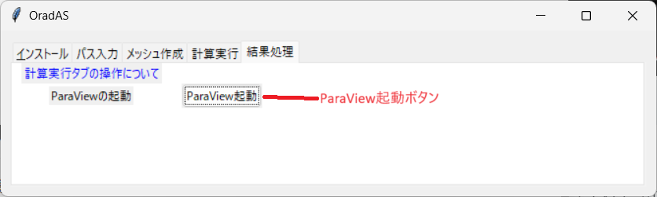
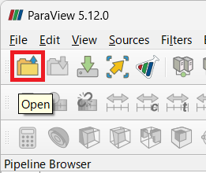
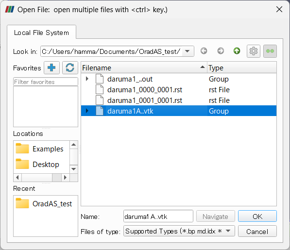
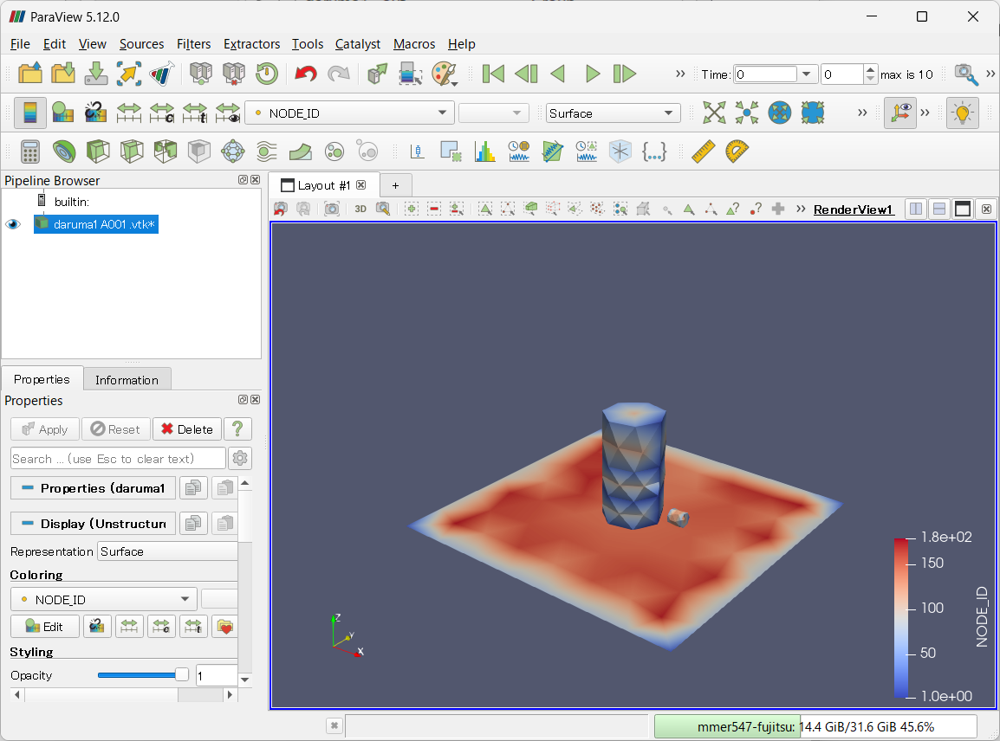

# 結果処理タブの操作方法について

結果処理タブでは次の機能を提供しています。

* ParaViewの起動

## ParaViewの起動

ParaView起動ボタンをクリックすることで、ParaViewが起動します。

ParaView起動後はOpenアイコンをクリックします。

計算実行フォルダにあるvtkファイルがまとめられた状態で表示されるので、それを選択してOpenをクリックします。

Applyを押して計算結果を表示し、結果の分析を開始してください。

