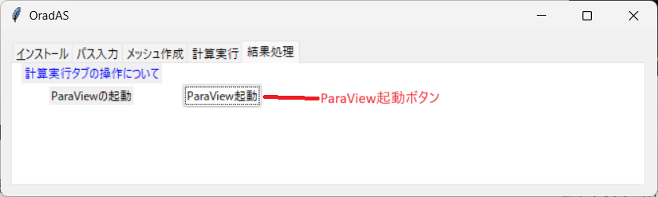
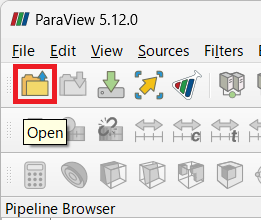

# How to Operate the Post-Processing Tab

The post-processing tab provides the following functionality:

* Launching ParaView

## Launching ParaView

Click the ParaView launch button to start ParaView.

After launching ParaView, click the Open icon.

The vtk files in the calculation execution folder will be displayed in a grouped state. Select them and click Open.

Click Apply to display the calculation results and start analyzing the results.

