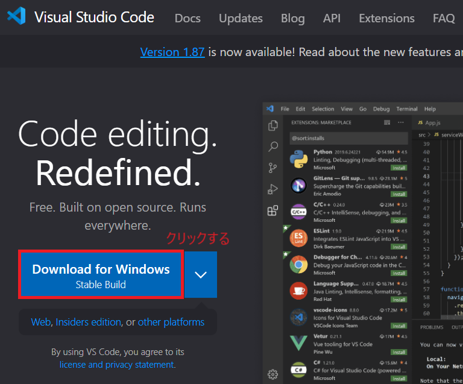
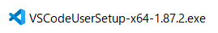
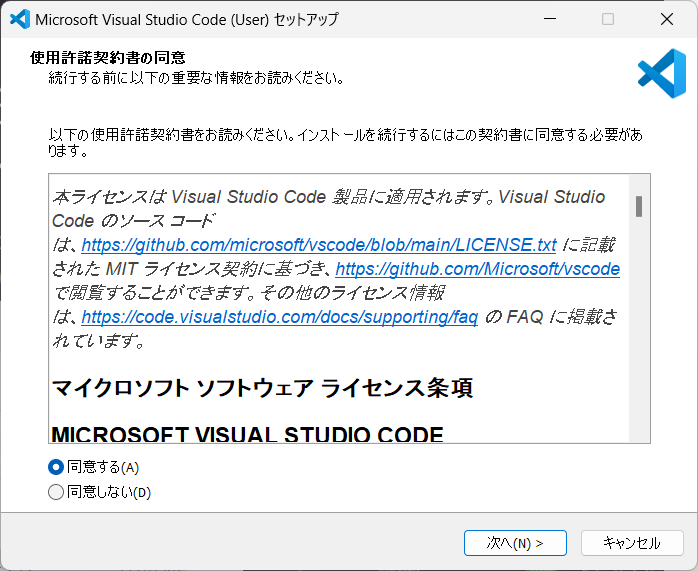
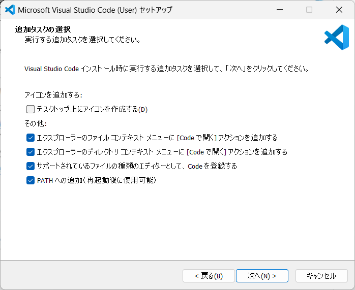
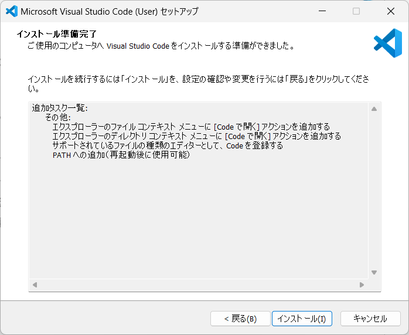
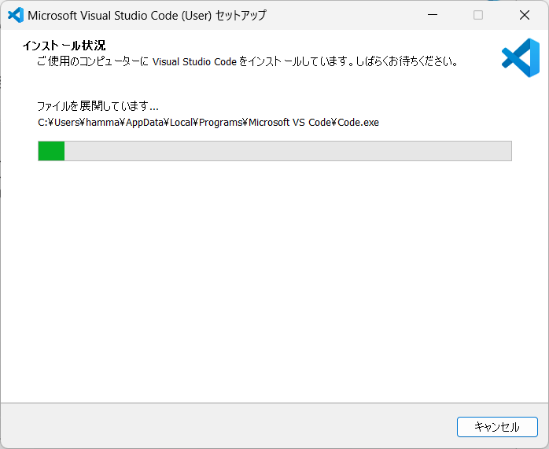
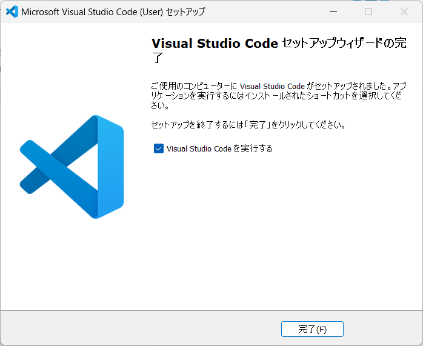
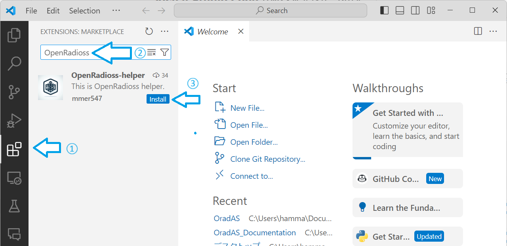
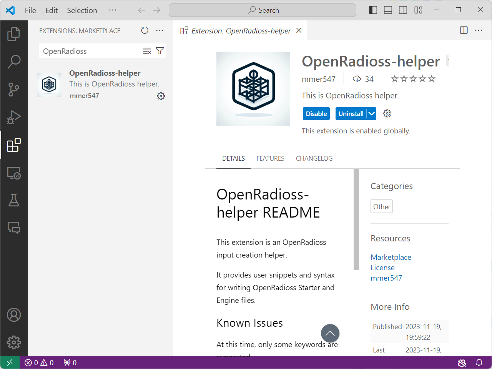

# Visual Studio Codeのインストール

## パッケージのダウンロード

Visual Studio Codeのパッケージを[Visual Studio CodeのWebページ](https://code.visualstudio.com/)からダウンロードします。

ダウンロードされたインストーラを起動する。

起動したら使用許諾の同意を求められるので、同意するにチェックを入れて次へをクリックする。

インストールのオプションがいくつか表示されるので、好きなものを選んで次へをクリックする。

インストール準備完了の画面が表示されるので、インストールをクリックする。

しばらく待ちます。

セットアップウィザードの完了と表示されたらVisual Studio Codeを実行するにチェックを入れたまま完了をクリックします。

つぎに拡張機能のインストールを実行します。

## VSCode拡張機能「OpenRadioss Helper」のインストール

VSCodeでインプットを作成する際に支援をする拡張機能をインストールします。

VSCodeが起動したら、①Extensionsをクリックします。②検索ボックスにOpenRadiossと入力します。OpenRadioss-helperが表示されたら③Installをクリックします。

下の画面が表示されたらインストールは完了です。

これでVSCodeのインストールは完了です。