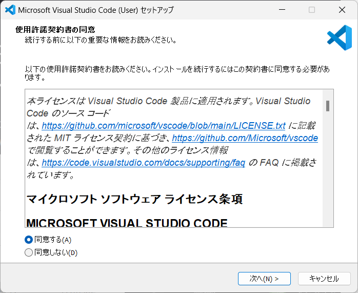
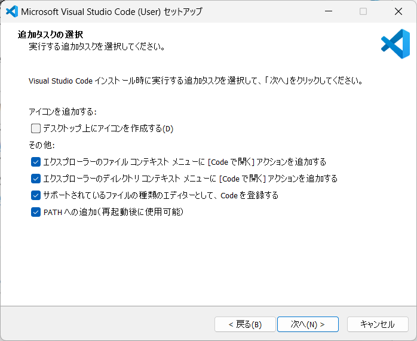
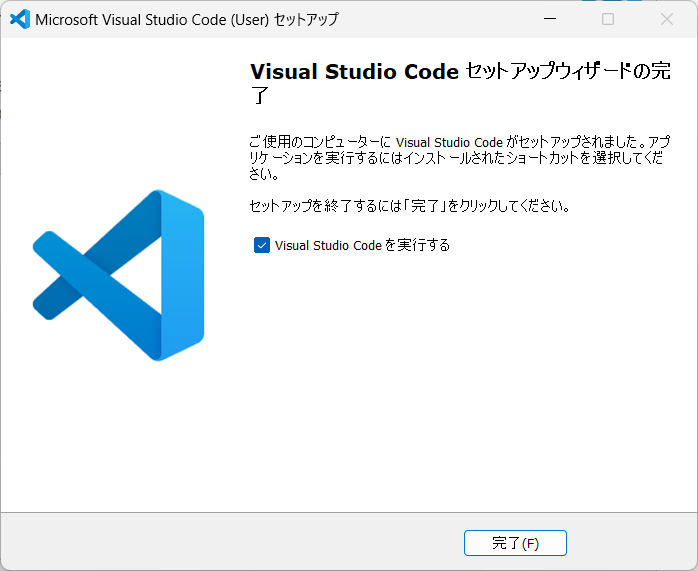
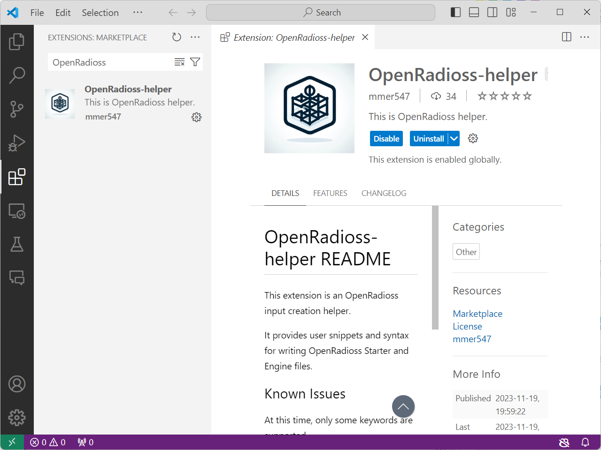

# Installing Visual Studio Code

## Downloading the Package

Download the Visual Studio Code package from the [Visual Studio Code Web Page](https://code.visualstudio.com/).

Launch the downloaded installer.

When it starts, you will be asked to agree to the license terms. Check the box to agree and click **Next**.

Several installation options will be displayed. Choose your preferred options and click **Next**.

When the installation preparation screen appears, click **Install**.

Wait for a while.

When the setup wizard displays "Setup Completed," leave the checkbox for "Launch Visual Studio Code" checked and click **Finish**.

Next, proceed to install extensions.

## Installing the VSCode Extension "OpenRadioss Helper"

Install an extension to assist in creating inputs in VSCode.

Once VSCode launches, click ① **Extensions**. In the search box, type **OpenRadioss**. When **OpenRadioss-helper** appears, click ③ **Install**.

When the screen below appears, the installation is complete.

This completes the installation of Visual Studio Code.